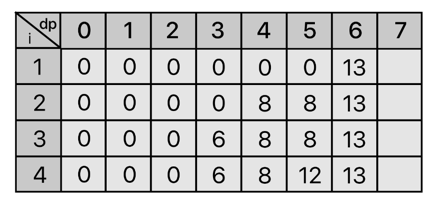

# 배낭 문제(knapsack)

* 유명한 조합 최적화 문제
* 보통 `짐을 쪼갤 수 있는 경우`, `쪼갤 수 없는 경우`로 나뉜다.

### 쪼갤 수 있는 경우(Fraction Knapsack Problem)
* `Greedy` 알고리즘을 사용하면 풀 수 있다.


### 쪼갤 수 없는 경우(0/1 Knapsack Problem)
* `DP` 알고리즘을 사용하면 풀 수 있다.

#### 예시 : 백준 12865 - 평범한 배낭

* 링크 : https://www.acmicpc.net/problem/12865
* 풀이
W[] 배열과 가치 V[] 배열이 있다고 할 때, 각 W[i] 의 무게에 대응되는 가치는 V[i]다. 
* 즉, (Wi, Vi) 로 표현하면...

```
(Wi, Vi) = (6, 13), (4, 8), (3, 6), (5, 12)
```


* 왜 (i=4) 구간이 6이냐고 물어본다면..  이미 3을 탐색했기 때문이다.
* 우리는 일치 여부를 확인하는 것이 아닌 가능 여부를 확인하는 것이다.


* 무게 4는 i = 2 부터 탐색되기 때문에 위와 같이 누적해주자.





* 이제부터가 진짜인데 7부터는 드디어 무게의 조합이 가능하다.
    * 무게 3, 4인 물건 2개를 가져가거나
    * 무게 5, 6인 물건 1개를 가져가거나
* 이 중 가장 큰 가치를 선택하면 된다.

이 원리를 사용하면 다음과 같은 점화식을 뽑아낼 수 있다.


```java
public class sol { int knapsack(int i, int k) {
    if (i < 0) return 0;

    if (dp[i][k] == null) {
      if (W[i] > k) { // 더 이상 물건을 못담는 무게라면?
        dp[i][k] = knapsack(i - 1, k);
      } else {        // 더 담을 수 있다면??
          dp[i][k] = Math.max(knapsack(i - 1, k), knapsack(i - 1, k - W[i] + V[i]))
      }
    }
    
    return dp[i][k];
  }
}
```